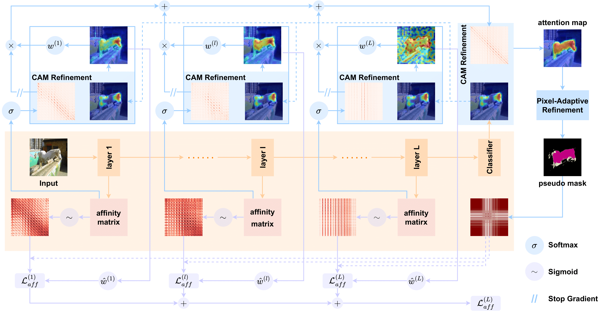

# AReAM

This repo is the PyTorch code for [Mitigating Undisciplined Over-Smoothing in Transformer for Weakly Supervised Semantic Segmentation](https://arxiv.org/abs/2305.03112).

<p align="center">
  
</p>
<p align="center">
Overview of AReAM.
</p>

## Data Preparation

Download [Visual Object Classes Challenge 2012 (VOC2012)](http://host.robots.ox.ac.uk/pascal/VOC/voc2012/). The augmented annotations are from [SBD dataset](http://home.bharathh.info/pubs/codes/SBD/download.html). After downloading [SegmentationClassAug.zip](https://www.dropbox.com/s/oeu149j8qtbs1x0/SegmentationClassAug.zip?dl=0), you should unzip it and move it to `VOCdevkit/VOC2012`.

``` bash
VOCdevkit/
└── VOC2012
    ├── JPEGImages
    ├── SegmentationClass
    ├── SegmentationClassAug
    ├──...
```

## Usage

Step 1 (optional): Download the checkpoint from the official repositoriy [MCTformer](https://github.com/xulianuwa/MCTformer) or [TransCAM](https://github.com/liruiwen/TransCAM) and check the layer-wise entropy.

```
# Option 1: MCTformer backbone
python ent_voc_mctformer.py --path $CHECKPOINT --data_dir $DATA_DIR

# Option 2: Conformer backbone
python ent_voc_conformer.py --path $CHECKPOINT --data_dir $DATA_DIR
```

Note that if this step is skipped, you can simply use the uniform weights.

Step 2: Train the classification model integrated with AReAM, then generate and evaluate CAMs.
Pretrained MCTformer can be obtained at this [link](https://dl.fbaipublicfiles.com/deit/deit_small_patch16_224-cd65a155.pth).
Pretrained Conformer can be obtained at this [link](https://github.com/pengzhiliang/Conformer).

```
# Option 1: MCTformer backbone
bash main_voc_mctformer.sh

# Option 2: Conformer backbone
bash main_voc_conformer.sh
```

| Backbone | Checkpoint | mIoU (%) |
| :------: | :--------: | :------: |
| MCTformer | [link](https://drive.google.com/file/d/1iEI3iej29wFLfT7gPXBU2x5BneeYklpV/view?usp=sharing) | 67.93 |
| Conformer | [link](https://drive.google.com/file/d/1SVAnTrNeC4jqTGmhpp21i5aWv_EFYu8U/view?usp=drive_link) | 70.69 |

Step 3: Train [PSA](https://github.com/jiwoon-ahn/psa) to post-process CAMs and generate pseudo segmentation labels.
The model is initialized with weights at this [link](https://drive.google.com/file/d/1xESB7017zlZHqxEWuh1Rb89UhjTGIKOA/view?usp=sharing).

```
bash main_psa.sh
```

Step 4: Train and evaluate the semantic segmentation model.
The model is initialized with weights at this [link](https://drive.google.com/file/d/1xESB7017zlZHqxEWuh1Rb89UhjTGIKOA/view?usp=sharing).
```
bash main_seg.sh
```

## Citation
```
@article{he2023mitigating,
  title={Mitigating Undisciplined Over-Smoothing in Transformer for Weakly Supervised Semantic Segmentation},
  author={He, Jingxuan and Cheng, Lechao and Fang, Chaowei and Zhang, Dingwen and Wang, Zhangye and Chen, Wei},
  journal={arXiv preprint arXiv:2305.03112},
  year={2023}
}
```

## Acknowledgment
This repo is based on [MCTformer](https://github.com/xulianuwa/MCTformer) and [TransCAM](https://github.com/liruiwen/TransCAM). Thanks for great works!